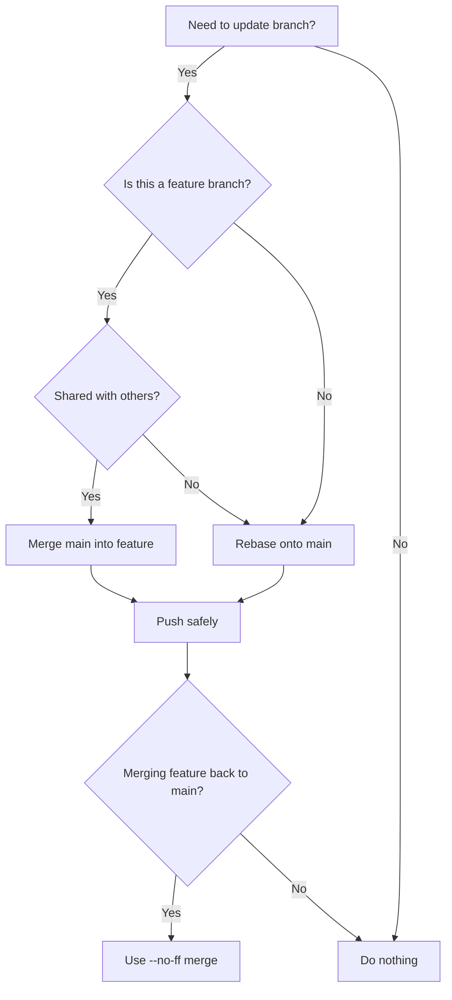

# 🚀 Git Real-Life Issues & Solutions

A practical guide for developers facing common Git issues in collaborative projects.

---

## 🔄 1. Syncing Branch After PR is Merged

**Issue:** After merging a PR, your local branch is outdated and shows conflicts.

**Solution:**

```bash
# Switch to main branch
git checkout main

# Fetch latest changes
git fetch origin

# Update local main
git pull origin main

# Delete feature branch locally (if no longer needed)
git branch -d feature-branch

# Delete feature branch remotely (optional)
git push origin --delete feature-branch
```

✅ Always **sync main before starting a new branch**.

---

## 🌲 2. Merge Conflicts During Merge

**Issue:** Conflicts occur when two branches modify the same code.

**Solution:**

```bash
# Try to merge
git merge feature-branch

# Conflict files will be marked >>>>>>> <<<<<<<
# Open files, manually edit conflicts, then:
git add <conflicted-files>
git commit
```

✅ Use tools like **VS Code GitLens** or `git mergetool` for easier conflict resolution.

---

## 🔀 3. Merge Conflicts During Rebase

**Issue:** Rebasing onto main causes conflicts.

**Solution:**

```bash
git checkout feature-branch

# Start rebase
git rebase main

# Resolve conflicts (same process as merge)
git add <files>

# Continue rebase
git rebase --continue

# If too messy, abort
git rebase --abort
```

✅ Rebase keeps history **cleaner** than merge, but requires careful conflict handling.

---

## ⚡ 4. Fast-Forward vs No Fast-Forward Merge

* **Fast-Forward (default if possible):** Moves branch pointer forward (no extra commit).

```bash
git merge --ff-only feature-branch
```

* **No Fast-Forward (`--no-ff`):** Creates a merge commit (preserves branch history).

```bash
git merge --no-ff feature-branch
```

✅ Teams usually prefer `--no-ff` for clarity of feature merges.

---

## 🛑 5. Accidentally Committed to Wrong Branch

**Solution:**

```bash
# Create new branch from current state
git checkout -b correct-branch

# Switch back and reset
git checkout main
git reset --hard origin/main
```

✅ Never push until you’re sure you’re on the correct branch.

---

## 🔁 6. Undoing Commits

* **Undo last commit but keep changes:**

```bash
git reset --soft HEAD~1
```

* **Undo last commit and discard changes:**

```bash
git reset --hard HEAD~1
```

* **Undo a pushed commit (dangerous):**

```bash
git revert <commit-hash>
```

✅ Prefer `git revert` over `reset` on shared branches.

---

## 📥 7. Pulling Changes Without Overwriting Local Work

**Issue:** `git pull` overwrites local changes.

**Solution:**

```bash
# Stash your changes
git stash

# Pull latest
git pull origin main

# Reapply stash
git stash pop
```

---

## 🚨 8. Detached HEAD State

**Issue:** You checked out a commit instead of a branch.

**Solution:**

```bash
# Create a new branch from detached state
git checkout -b new-branch
```

✅ Always work on branches, not commits.

---

## 🧹 9. Cleaning Up Old Branches

**Local cleanup:**

```bash
git branch -d old-feature
```

**Remote cleanup:**

```bash
git push origin --delete old-feature
```

**Prune deleted branches:**

```bash
git fetch --prune
```

---

## 🛡️ 10. Best Practices to Avoid Git Issues

1. Always pull/rebase before pushing.
2. Keep branches **short-lived**.
3. Use **feature branches**, avoid direct commits to main.
4. Prefer `git rebase main` over merge (unless policy requires merge).
5. Use **descriptive commit messages**.
6. Review your changes with `git status` and `git diff` before commit.

---

## 🌍 11. Real-World Git Workflows

### 🔹 GitHub Flow (simple, widely used)

* **Branches:** main + short-lived feature branches.
* **Merge strategy:** Fast-forward or squash merges.
* **When to rebase:** Before opening a PR, rebase feature branch onto main.

✅ Best for small teams, continuous delivery.

---

### 🔹 GitLab Flow

* **Branches:** main, production, feature branches.
* **Merge strategy:** Merge Requests (MRs) with `--no-ff` to keep history.
* **When to rebase:** Before merging MR into main.

✅ Good for projects needing **environment branches** (staging, production).

---

### 🔹 Trunk-Based Development

* **Branches:** Mostly just `main` (aka trunk).
* **Merge strategy:** Frequent merges to main (feature flags used instead of long branches).
* **When to rebase:** Rare, since features are small and merged daily.

✅ Ideal for large-scale teams with continuous integration.

---

## 🔎 12. Merge vs Rebase Decision Flow



✅ **Rule of thumb:**

* Use **rebase** to update your own branch before PR.
* Use **merge (`--no-ff`)** to bring feature branch into main for history clarity.

---

## 🛠️ 13. Common Git Errors & Fixes

### ❌ Error: `non-fast-forward updates were rejected`

* **Cause:** Remote branch has new commits.
* **Fix:**

```bash
git pull --rebase origin main
git push origin main
```

---

### ❌ Error: `Your branch is ahead/behind origin/main`

* **Cause:** Local branch diverged.
* **Fix:**

```bash
# Rebase onto latest
git fetch origin
git rebase origin/main
```

---

### ❌ Error: `Updates were rejected because the remote contains work that you do not have locally`

* **Fix:**

```bash
git pull --rebase origin <branch>
```

---

### ❌ Error: `fatal: A branch named 'X' already exists`

* **Fix:**

```bash
git branch -d X       # delete local branch (if safe)
git checkout -b X-new  # create with new name
```

---

### ❌ Error: `fatal: refusing to merge unrelated histories`

* **Cause:** Two repositories initialized separately.
* **Fix:**

```bash
git pull origin main --allow-unrelated-histories
```

---

### ❌ Error: `error: failed to push some refs`

* **Cause:** Conflict with remote branch.
* **Fix:**

```bash
git pull --rebase origin <branch>
git push origin <branch>
```

---

## 📚 Summary Cheatsheet

* Sync branch: `git fetch && git pull`
* Merge with history: `git merge --no-ff`
* Rebase onto main: `git rebase main`
* Resolve conflicts: edit → `git add` → `git rebase --continue`
* Undo commit: `git reset --soft HEAD~1`
* Safe undo (shared): `git revert <hash>`
* Stash work: `git stash && git stash pop`
* Cleanup: `git branch -d <name>` + `git push origin --delete <name>`
* Workflow choice:

  * GitHub Flow → small/medium teams
  * GitLab Flow → staging/production environments
  * Trunk-Based → large orgs, CI/CD heavy
* Troubleshooting:

  * Non-fast-forward → `git pull --rebase`
  * Branch diverged → `git rebase origin/main`
  * Unrelated histories → `git pull --allow-unrelated-histories`

---

---

## 🧭 14. Rebase & Pull Strategies — the **true / false / ff-only** trilogy

When you run `git pull`, Git needs to reconcile your local branch with the remote. There are **three main strategies** you can choose from via flags or config:

| Goal                                   | How to set (one-time)                   | One-off command        | What it does                                                                      | Typical use                                                                    |
| -------------------------------------- | --------------------------------------- | ---------------------- | --------------------------------------------------------------------------------- | ------------------------------------------------------------------------------ |
| **Merge (pull.rebase = false)**        | `git config --global pull.rebase false` | `git pull --no-rebase` | Creates a **merge commit** when needed.                                           | Teams that prefer visible merge commits and do not rewrite history.            |
| **Rebase (pull.rebase = true)**        | `git config --global pull.rebase true`  | `git pull --rebase`    | **Replays** your local commits **on top** of the remote; keeps history linear.    | Feature branches; cleaner history; fewer merge commits.                        |
| **Fast-forward only (pull.ff = only)** | `git config --global pull.ff only`      | `git pull --ff-only`   | **Refuses to create** a merge commit; **aborts** if fast-forward is not possible. | Protect `main`/`trunk` from accidental merges; enforce pre-rebase before pull. |

> Per-branch setting (recommended): `git config branch.<name>.rebase true` (or `false`).

### Suggested policy

* On **feature branches**: `pull.rebase = true` (or always use `git pull --rebase`).
* On **main**: `pull.ff = only` to prevent accidental local merges into main.

### Related merge flags (when integrating features):

* `--ff-only` → fail if not FF; `--no-ff` → always create merge commit; default `--ff` tries to FF, else creates a merge commit.

---

## 🧩 15. Rebase Edge Cases & Fixes (think: all the ways it can go sideways)

### 15.1 Rebase stops: *“You have unstaged changes”*

**Cause:** Local modifications conflict with rebase.
**Fix:**

```bash
git status
# Option A: keep and auto-stash during pull
git pull --rebase --autostash
# Option B: manual
git stash -u && git rebase origin/main && git stash pop
```

### 15.2 Rebase conflicts on many commits

**Fix loop:**

```bash
git rebase origin/main
# Resolve files (use IDE or):
#   pick mine:    git checkout --ours  <file>
#   pick theirs:  git checkout --theirs <file>
# or use strategy option cautiously: -X ours | -X theirs

git add <file(s)>
git rebase --continue      # or --skip for an unimportant commit
# bail out if too messy:
git rebase --abort
```

**Tip:** enable conflict reuse: `git config --global rerere.enabled true`.

### 15.3 *Dropped commit* after rebase

**Symptoms:** Something you had locally is gone.
**Recovery:**

```bash
# Recover with reflog
git reflog
# Find pre-rebase HEAD, then:
git checkout -b rescue <that_sha>
# cherry-pick the lost commit(s) onto your branch
```

### 15.4 Force-push required after rebase

**Reason:** Rebasing rewrites commit SHAs. Remote rejects push.
**Safe push:**

```bash
git push --force-with-lease origin <branch>
```

> Use `--force-with-lease` (not plain `--force`) to avoid overwriting teammates’ work.

### 15.5 *“fatal: Not possible to fast-forward, aborting”* when pulling with `--ff-only`

**Cause:** Your local branch has unique commits; FF is impossible.
**Fix:** Rebase your commits on top of remote, then push.

```bash
git fetch origin
git rebase origin/<branch>
# then
git push
```

### 15.6 *“hint: You have divergent branches and need to specify how to reconcile them.”*

**Cause:** Newer Git requires you to choose a strategy.
**Fix (pick one policy):**

```bash
# Merge style
git config --global pull.rebase false
# or Rebase style
git config --global pull.rebase true
# or FF-only
git config --global pull.ff only
```

### 15.7 Rebasing branches that contain **merge commits**

**Problem:** Default rebase flattens merges.
**Fix:** Preserve merges explicitly.

```bash
git rebase --rebase-merges origin/main
# (old/legacy: --preserve-merges)
```

### 15.8 Interactive rebase pitfalls (`-i`)

* **Squashing/rewriting history** means you will need `--force-with-lease` to push.
* **Changing commit order** can break builds/tests; run tests before force-pushing.
* **Fixup/squash workflow:**

```bash
git commit --fixup <sha>
git rebase -i --autosquash origin/main
```

### 15.9 Rebase across a **force-pushed** upstream

**Symptoms:** Confusing conflicts; your upstream rewrote history.
**Approach:**

```bash
git fetch origin
# create a safety copy before rebasing onto the new upstream
git checkout -b backup-before-upstream-change
# then rebase
git checkout <your-branch>
git rebase origin/main
```

### 15.10 Binary or large-file conflicts during rebase

* Prefer “ours/theirs” resolution to avoid corrupting binaries.

```bash
git checkout --theirs path/to/asset.bin
# or
git checkout --ours  path/to/asset.bin
```

### 15.11 Aborted mid-rebase and stuck state

**Fix:**

```bash
git rebase --abort       # safest reset
# If still stuck, cleanup rebase metadata:
rm -rf .git/rebase-apply .git/rebase-merge
```

### 15.12 Rebase vs Merge policy drift

**Symptom:** Some devs merge, others rebase → noisy history.
**Fix:** Enforce with repo config & CI checks.

* Protect `main` and require **FF-only**.
* Document standard: *feature branches rebase before PR; merges into main use `--no-ff` or squash*.

### 15.13 Preserve authorship & dates

* Rebasing preserves **author**; **committer date** changes (expected).
* If you amend author:

```bash
git commit --amend --author="Name <email>"
```

### 15.14 Autosync on pull for busy repos

* `git pull --rebase --autostash` reduces friction when you forget to stash.
* Consider alias:

```bash
git config --global alias.up "pull --rebase --autostash"
```

---

## 🧾 16. Ready-to-copy `.gitconfig` snippets

```ini
# Enforce linear feature branches\ n[pull]
    rebase = true

# Protect main from accidental merges
[branch "main"]
    ff = only

# Prefer safer force pushes
[push]
    default = current

# Reuse recorded conflict resolutions
[rerere]
    enabled = true
```

> Per-branch rebase: `git config branch.<branch>.rebase true`.

---

## ⚡ Quick Decision: true vs false vs ff-only

* **`pull.rebase = true`** → You want **linear history** on **feature branches**.
* **`pull.rebase = false`** → You accept **merge commits** and want to avoid rewriting history.
* **`pull.ff = only`** → You want **safety on main**; disallow accidental merges; force devs to rebase first.

---
