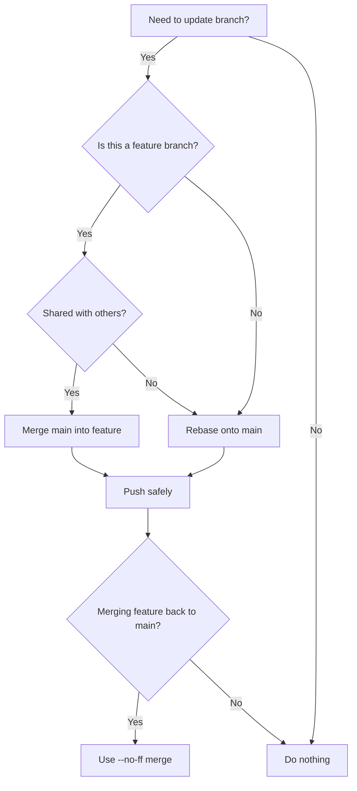

# 🚀 Git Real-Life Issues & Solutions

A practical guide for developers facing common Git issues in collaborative projects.

---

## 🔄 1. Syncing Branch After PR is Merged

**Issue:** After merging a PR, your local branch is outdated and shows conflicts.

**Solution:**

```bash
# Switch to main branch
git checkout main

# Fetch latest changes
git fetch origin

# Update local main
git pull origin main

# Delete feature branch locally (if no longer needed)
git branch -d feature-branch

# Delete feature branch remotely (optional)
git push origin --delete feature-branch
```

✅ Always **sync main before starting a new branch**.

---

## 🌲 2. Merge Conflicts During Merge

**Issue:** Conflicts occur when two branches modify the same code.

**Solution:**

```bash
# Try to merge
git merge feature-branch

# Conflict files will be marked >>>>>>> <<<<<<<
# Open files, manually edit conflicts, then:
git add <conflicted-files>
git commit
```

✅ Use tools like **VS Code GitLens** or `git mergetool` for easier conflict resolution.

---

## 🔀 3. Merge Conflicts During Rebase

**Issue:** Rebasing onto main causes conflicts.

**Solution:**

```bash
git checkout feature-branch

# Start rebase
git rebase main

# Resolve conflicts (same process as merge)
git add <files>

# Continue rebase
git rebase --continue

# If too messy, abort
git rebase --abort
```

✅ Rebase keeps history **cleaner** than merge, but requires careful conflict handling.

---

## ⚡ 4. Fast-Forward vs No Fast-Forward Merge

* **Fast-Forward (default if possible):** Moves branch pointer forward (no extra commit).

```bash
git merge --ff-only feature-branch
```

* **No Fast-Forward (`--no-ff`):** Creates a merge commit (preserves branch history).

```bash
git merge --no-ff feature-branch
```

✅ Teams usually prefer `--no-ff` for clarity of feature merges.

---

## 🛑 5. Accidentally Committed to Wrong Branch

**Solution:**

```bash
# Create new branch from current state
git checkout -b correct-branch

# Switch back and reset
git checkout main
git reset --hard origin/main
```

✅ Never push until you’re sure you’re on the correct branch.

---

## 🔁 6. Undoing Commits

* **Undo last commit but keep changes:**

```bash
git reset --soft HEAD~1
```

* **Undo last commit and discard changes:**

```bash
git reset --hard HEAD~1
```

* **Undo a pushed commit (dangerous):**

```bash
git revert <commit-hash>
```

✅ Prefer `git revert` over `reset` on shared branches.

---

## 📥 7. Pulling Changes Without Overwriting Local Work

**Issue:** `git pull` overwrites local changes.

**Solution:**

```bash
# Stash your changes
git stash

# Pull latest
git pull origin main

# Reapply stash
git stash pop
```

---

## 🚨 8. Detached HEAD State

**Issue:** You checked out a commit instead of a branch.

**Solution:**

```bash
# Create a new branch from detached state
git checkout -b new-branch
```

✅ Always work on branches, not commits.

---

## 🧹 9. Cleaning Up Old Branches

**Local cleanup:**

```bash
git branch -d old-feature
```

**Remote cleanup:**

```bash
git push origin --delete old-feature
```

**Prune deleted branches:**

```bash
git fetch --prune
```

---

## 🛡️ 10. Best Practices to Avoid Git Issues

1. Always pull/rebase before pushing.
2. Keep branches **short-lived**.
3. Use **feature branches**, avoid direct commits to main.
4. Prefer `git rebase main` over merge (unless policy requires merge).
5. Use **descriptive commit messages**.
6. Review your changes with `git status` and `git diff` before commit.

---

## 🌍 11. Real-World Git Workflows

### 🔹 GitHub Flow (simple, widely used)

* **Branches:** main + short-lived feature branches.
* **Merge strategy:** Fast-forward or squash merges.
* **When to rebase:** Before opening a PR, rebase feature branch onto main.

✅ Best for small teams, continuous delivery.

---

### 🔹 GitLab Flow

* **Branches:** main, production, feature branches.
* **Merge strategy:** Merge Requests (MRs) with `--no-ff` to keep history.
* **When to rebase:** Before merging MR into main.

✅ Good for projects needing **environment branches** (staging, production).

---

### 🔹 Trunk-Based Development

* **Branches:** Mostly just `main` (aka trunk).
* **Merge strategy:** Frequent merges to main (feature flags used instead of long branches).
* **When to rebase:** Rare, since features are small and merged daily.

✅ Ideal for large-scale teams with continuous integration.

---

## 🔎 12. Merge vs Rebase Decision Flow



✅ **Rule of thumb:**

* Use **rebase** to update your own branch before PR.
* Use **merge (`--no-ff`)** to bring feature branch into main for history clarity.

---

## 🛠️ 13. Common Git Errors & Fixes

### ❌ Error: `non-fast-forward updates were rejected`

* **Cause:** Remote branch has new commits.
* **Fix:**

```bash
git pull --rebase origin main
git push origin main
```

---

### ❌ Error: `Your branch is ahead/behind origin/main`

* **Cause:** Local branch diverged.
* **Fix:**

```bash
# Rebase onto latest
git fetch origin
git rebase origin/main
```

---

### ❌ Error: `Updates were rejected because the remote contains work that you do not have locally`

* **Fix:**

```bash
git pull --rebase origin <branch>
```

---

### ❌ Error: `fatal: A branch named 'X' already exists`

* **Fix:**

```bash
git branch -d X       # delete local branch (if safe)
git checkout -b X-new  # create with new name
```

---

### ❌ Error: `fatal: refusing to merge unrelated histories`

* **Cause:** Two repositories initialized separately.
* **Fix:**

```bash
git pull origin main --allow-unrelated-histories
```

---

### ❌ Error: `error: failed to push some refs`

* **Cause:** Conflict with remote branch.
* **Fix:**

```bash
git pull --rebase origin <branch>
git push origin <branch>
```

---

## 📚 Summary Cheatsheet

* Sync branch: `git fetch && git pull`
* Merge with history: `git merge --no-ff`
* Rebase onto main: `git rebase main`
* Resolve conflicts: edit → `git add` → `git rebase --continue`
* Undo commit: `git reset --soft HEAD~1`
* Safe undo (shared): `git revert <hash>`
* Stash work: `git stash && git stash pop`
* Cleanup: `git branch -d <name>` + `git push origin --delete <name>`
* Workflow choice:

  * GitHub Flow → small/medium teams
  * GitLab Flow → staging/production environments
  * Trunk-Based → large orgs, CI/CD heavy
* Troubleshooting:

  * Non-fast-forward → `git pull --rebase`
  * Branch diverged → `git rebase origin/main`
  * Unrelated histories → `git pull --allow-unrelated-histories`

---
